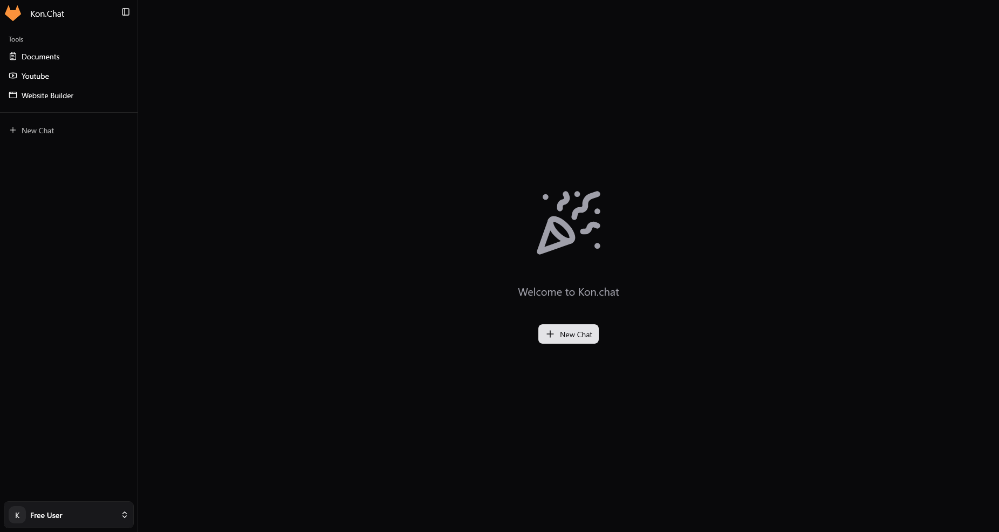
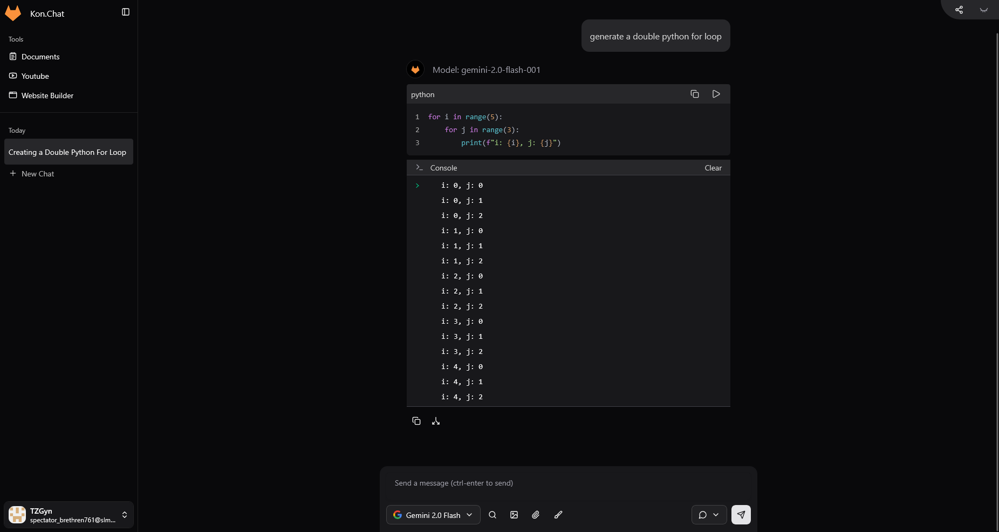
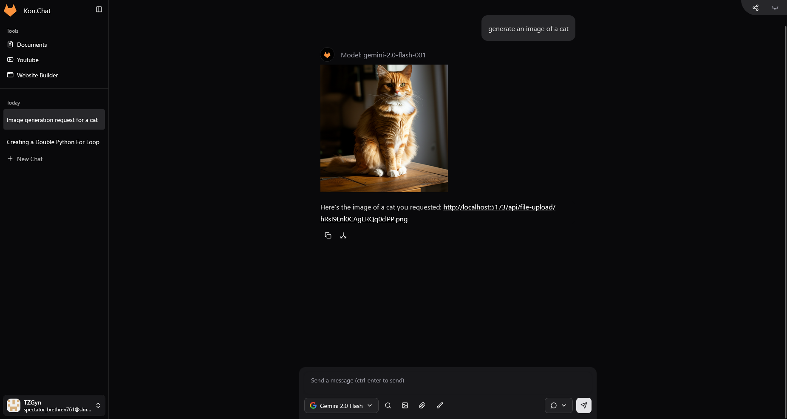
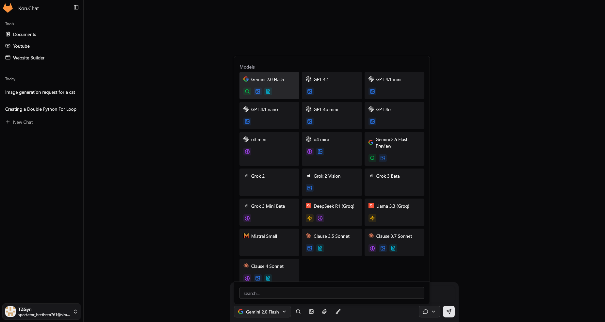
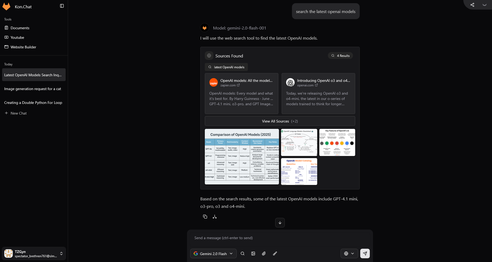
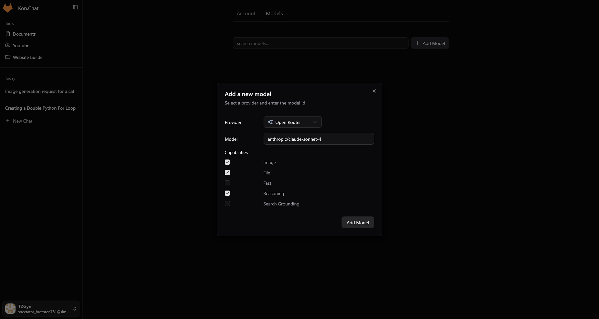

<p align="center">
	
</p>
<h1 align="center">
	Kon.Chat
</h1>

All in one chat app with search tools and file uploads

## Deployment templates

[](https://railway.com/deploy/konchat?referralCode=bSruGU)

# Preview + Features

## Homepage



## Code block



## Image Generation



## Multi Models



## Search Tool



## Search Tool



## Developing

```bash
bun --bun run dev
```

## Building

To create a production version of your app:

```bash
bun --bun run build
```
